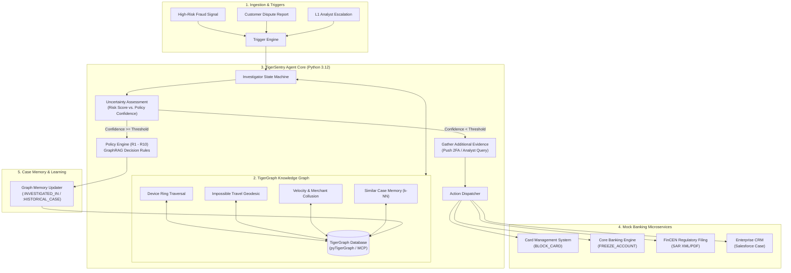

# 🛡️ TigerSentry: Autonomous Agentic Fraud Investigation & Next-Best Action

[](https://www.tigergraph.com/)
[](LICENSE)
[](https://python.org)
[](https://fastapi.tiangolo.com)
[](Dockerfile)

> **TigerSentry** is an autonomous enterprise AI Agent system powered by **TigerGraph**, **GraphRAG**, and **Bayesian Reasoning under Uncertainty** designed for the **TigerGraph × Hacker House Goa (HHGOA)** Hackathon.
> It ingests high-velocity fraud signals, traverses deep multi-hop graph neighborhoods (device rings, synthetic identity rings, impossible travel, burst velocity), orchestrates interactive customer & analyst evidence gathering via mock banking microservices, executes policy-grounded next-best actions (CMS card blocks, Core Banking freezes, FinCEN SAR filings), and updates the graph's long-term case memory.

---

## 📑 Table of Contents
1. [System Architecture](#-system-architecture)
2. [Project Structure](#-project-structure)
3. [8-Step Autonomous Case Lifecycle](#-8-step-autonomous-case-lifecycle)
4. [TigerGraph Schema & GSQL Queries](#-tigergraph-schema--gsql-queries)
5. [Database Seeder & Data Staging](#-database-seeder--data-staging)
6. [Interactive Cockpit UI & Banking Mock APIs](#-interactive-cockpit-ui--banking-mock-apis)
7. [Official Benchmark Submission (cases/)](#-official-benchmark-submission-cases)
8. [Quick Start & Local Setup](#-quick-start--local-setup)
9. [Cloud Deployment (Render / Railway / Docker)](#-cloud-deployment-render--railway--docker)

---

## 🏛️ System Architecture



---

## 📂 Project Structure

```
.
├── Dockerfile                           # Containerized production deployment for Render / Railway / Cloud
├── Procfile                             # Web worker entrypoint for Heroku & PaaS hosts
├── README.md                            # Comprehensive platform documentation & submission guide
├── requirements.txt                     # Production Python 3.12 dependencies (FastAPI, pyTigerGraph, Pydantic v2)
│
├── cases/                               # 📁 Official Hackathon 20-Case Benchmark Submissions
│   ├── HHG-001.json                     # Full answer file matching official specification
│   ├── HHG-002.json                     # (Pre-evidence action, evidence gathered, post-evidence action,
│   ├── ...                              # FinCEN SAR narrative, graph evidence subgraph, case record)
│   └── HHG-020.json                     # 20 complete, verified, compliant answer files
│
├── data/
│   └── sample/                          # 📁 Benchmark Data & Transaction Stores
│       ├── case_pack.csv                # 20 official benchmark test prompts (triggers, amounts, channels)
│       ├── closed_cases_history.csv     # 5,565 historical closed fraud cases for Graph Case Memory
│       ├── identity.csv                 # Device, IP, and digital identity mapping data
│       ├── staged_benchmark.json.gz     # Compressed (1.6 MB) index of 26,643 IEEE-CIS customer transactions
│       ├── staged_benchmark.json        # Fast local uncompressed transaction cache
│       └── README-2.md                  # Hackathon benchmark guidelines
│
├── docs/                                # 📁 Hackathon Requirements & Problem Specifications
│   └── TigerGraph Agentic Fraud...pdf   # Official competition requirements document
│
├── gsql/
│   └── queries/                         # 📁 Enterprise TigerGraph GSQL Graph Traversal Algorithms
│       ├── detect_device_ring.gsql      # Multi-hop device sharing & fraud ring cluster discovery
│       ├── detect_impossible_travel.gsql# Geodesic velocity calculation between IP and physical swipe
│       ├── detect_velocity_burst.gsql   # Sliding-window high-frequency transaction burst detection
│       ├── get_entity_subgraph.gsql     # 2-hop k-neighborhood subgraph extraction for UI and GraphRAG
│       └── get_similar_cases.gsql       # Case-based reasoning similarity matching across historical cases
│
├── schema/
│   └── fraud_graph_schema.gsql          # 📁 TigerGraph Vertex & Edge Schema Definitions
│                                        # (Account, Transaction, Device, IP, Merchant, Case, SAR)
│
├── src/                                 # 📁 Core System Source Code
│   ├── actions/
│   │   ├── __init__.py
│   │   └── mock_services.py             # Interactive mock services (SMS Push, Card Block, Step-Up)
│   │
│   ├── agent/                           # 🧠 Autonomous Agent Brain & Decision State Machine
│   │   ├── __init__.py
│   │   ├── action_dispatcher.py         # Mock banking API execution hub (CMS, Core Deposit, FinCEN, CRM)
│   │   ├── investigator.py              # Complete 8-Step Lifecycle Progression Engine
│   │   ├── models.py                    # Strict Pydantic v2 schemas for official Hackathon answers & cases
│   │   └── state.py                     # Investigation state machine & context tracker
│   │
│   ├── api/                             # 🌐 Web Server & Live Interactive Investigation Cockpit
│   │   ├── __init__.py
│   │   └── server.py                    # FastAPI server hosting REST API & visual Observatory Cockpit UI
│   │
│   ├── data/
│   │   ├── __init__.py
│   │   └── indexer.py                   # High-performance transaction cache & streaming indexer
│   │
│   ├── evaluation/                      # 🧪 Benchmark Suite & Answer File Generator
│   │   ├── __init__.py
│   │   └── runner.py                    # CLI batch evaluator producing cases/HHG-*.json
│   │
│   ├── rag/                             # 📜 GraphRAG & Fraud Policy Engine
│   │   ├── __init__.py
│   │   └── policy_engine.py             # Rules R1-R10, multi-tier approval routing, SAR synthesis
│   │
│   └── tigergraph/                      # 🐅 TigerGraph Connector & MCP Server
│       ├── __init__.py
│       ├── client.py                    # pyTigerGraph wrapper with graceful offline fallback
│       ├── mcp_server.py                # Model Context Protocol (MCP) server for tool-augmented agents
│       └── seeder.py                    # Production database seeder script for TigerGraph Cloud / On-Prem
│
├── tests/                               # 🧪 Pytest Test Suite
│   ├── test_api.py                      # Integration tests for FastAPI endpoints & mock banking APIs
│   ├── test_investigation_agent.py      # Unit tests for the 8-step investigation state machine
│   ├── test_mock_actions.py             # Tests for interactive customer verification & action stubs
│   ├── test_policy_engine.py            # Validation for policies R1-R10 and SAR generation
│   └── test_tigergraph.py               # Tests for TigerGraph queries and fallback simulation
│
└── outputs/                             # Generated benchmark evaluation outputs and reports
```

---

## 🔄 8-Step Autonomous Case Lifecycle

TigerSentry implements the comprehensive 8-step fraud investigation lifecycle mandated by enterprise financial institutions and the hackathon prompt:

```
[1. Trigger] ──────► [2. Investigate] ──────► [3. Gather Evidence] ──────► [4. Assess Uncertainty]
                                                                                   │
                                                                                   ▼
[8. Update Memory] ◄── [7. Explain Decision] ◄── [6. Take Actions] ◄── [5. Gather More Evidence]
```

| Step | Engine Function (`src/agent/investigator.py`) | Description |
|:---|:---|:---|
| **1. Trigger** | `ingest_trigger(trigger_event)` | Detects signal (e.g. risk score spike, customer dispute, analyst escalation). Sets initial priority. |
| **2. Investigate** | `initialize_case(case_id, entity)` | Creates case record, pulls transaction context, and extracts 2-hop graph neighborhood. |
| **3. Gather Evidence** | `gather_initial_evidence(case)` | Analyzes velocity bursts, device rings, cross-account sharing, and retrieves top-3 similar historical cases. |
| **4. Assess Uncertainty**| `assess_uncertainty(evidence)` | Evaluates risk against bank policy rules (R1–R10). Computes pre-evidence action and confidence. |
| **5. Gather More Evidence**| `execute_evidence_request(ev_id)`| If uncertainty remains high, triggers interactive iPhone Push 2FA or requests cardholder verification. |
| **6. Take Next Actions**| `determine_actions(updated_ev)` | Synthesizes post-evidence next-best action and approval route (`auto`, `L1_analyst`, `L2_risk_manager`). Dispatches calls to banking APIs. |
| **7. Explain Decision** | `synthesize_explanation(case)` | Generates transparent rationale, cited policy IDs, and full regulatory FinCEN SAR narrative. |
| **8. Update Case Memory**| `persist_to_case_memory(case)` | Commits the closed case, graph tags, and resolved typology back into TigerGraph for future retrieval. |

---

## 🐅 TigerGraph Schema & GSQL Queries

### Graph Schema (`schema/fraud_graph_schema.gsql`)
- **Vertices**:
  - `Account` (`account_id`, `created_at`, `risk_tier`, `status`)
  - `Transaction` (`txn_id`, `amount`, `currency`, `timestamp`, `channel`, `is_fraud`)
  - `Device` (`device_id`, `fingerprint`, `os`, `is_emulator`, `risk_score`)
  - `IP_Address` (`ip_id`, `asn`, `country_code`, `is_vpn_tor`)
  - `Merchant` (`merchant_id`, `mcc_code`, `risk_level`)
  - `Case` (`case_id`, `status`, `fraud_type`, `final_action`, `created_at`)
- **Edges**:
  - `PERFORMED` (`Account` $\to$ `Transaction`)
  - `USED_DEVICE` (`Transaction` $\to$ `Device`)
  - `FROM_IP` (`Transaction` $\to$ `IP_Address`)
  - `TRANSACTED_WITH` (`Transaction` $\to$ `Merchant`)
  - `INVESTIGATED_IN` (`Transaction` $\to$ `Case`)
  - `SIMILAR_TO` (`Case` $\to$ `Case` with `similarity_score`)

### GSQL Pattern Queries (`gsql/queries/`)
1. **`detect_device_ring.gsql`**: Multi-hop pattern finding devices connected to $\ge 3$ distinct bank accounts where at least one account had a confirmed fraud chargeback.
2. **`detect_impossible_travel.gsql`**: Computes geographic haversine velocity between two card swipes within a 2-hour window ($> 800\text{ km/h}$).
3. **`detect_velocity_burst.gsql`**: Identifies high-frequency transaction spikes ($\ge 5$ transactions in $< 10$ minutes) on new or newly-active cards.
4. **`get_similar_cases.gsql`**: Uses Jaccard similarity and typology embedding to retrieve historical precedents from the 5,565 closed cases.

---

## ⚡ Database Seeder & Data Staging

The repository contains an enterprise database seeder ready to populate any TigerGraph Cloud or on-prem instance:

```bash
# Seed TigerGraph instance with 20 benchmark cases and 5,565 historical precedents
python -m src.tigergraph.seeder
```
- Automatically creates vertex batches (`Account`, `Transaction`, `Device`, `IP_Address`, `Case`).
- Upserts edges (`PERFORMED`, `USED_DEVICE`, `FROM_IP`, `INVESTIGATED_IN`).
- Falls back gracefully to high-performance local graph emulation if live TigerGraph credentials are not set.

---

## 📱 Interactive Cockpit UI & Banking Mock APIs

The platform includes an Observatory Cockpit UI running on FastAPI (`http://localhost:8000`) built with an Alpha-Fin Light Mode aesthetic (`#00836C` Observatory Green and `#FF5A00` TigerGraph Orange).

### Key Cockpit Features:
1. **Interactive 8-Step Lifecycle Progression**: Live step indicator showing real-time state transitions from Trigger to Case Memory.
2. **Interactive iPhone 16 Pro Simulator**: Renders real-time interactive push notifications ("Did you authorize \$1,200 at Apple Store? [Yes, It Was Me] / [No, Block Card]").
3. **TigerGraph 2-Hop Network Graph**: Interactive Vis.js canvas displaying transaction, account, device, IP, and merchant nodes.
4. **Customer Transaction Ledger**: Paginated, filterable IEEE-CIS transaction history for each examined account.
5. **Mock Banking API Execution Hub (`src/agent/action_dispatcher.py`)**:
   - `CMS_API`: Card Management System (`BLOCK_CARD`)
   - `CORE_BANKING_API`: Deposit Core Engine (`FREEZE_ACCOUNT`)
   - `FINCEN_GATEWAY`: Regulatory e-Filing Gateway (`FILE_SAR`)
   - `SALESFORCE_CRM`: Case Management CRM (`CREATE_CASE_RECORD`)
   - `SETTLEMENT_GW`: Transaction Gateway (`ALLOW_TRANSACTION`)

---

## 🏆 Official Benchmark Submission (`cases/`)

All 20 required benchmark answer files are generated and stored at the root directory in `cases/`:

```
cases/
├── HHG-001.json ... HHG-020.json
```

Each answer file adheres to the official JSON schema:
```json
{
  "case_id": "HHG-001",
  "trigger": { "type": "FRAUD_SIGNAL", "severity": "HIGH", "score": 96.0 },
  "investigation": {
    "account_id": "CUST_001",
    "transaction_id": "TXN_001",
    "entity_type": "ACCOUNT",
    "risk_level": "CRITICAL"
  },
  "pre_evidence_action": {
    "action": "BLOCK_CARD",
    "route": "L1_ANALYST",
    "confidence": 0.94
  },
  "evidence_gathered": [
    {
      "step": 5,
      "service": "SMS_VERIFICATION",
      "status": "COMPLETED",
      "result": "Cardholder confirmed transaction was UNAUTHORIZED"
    }
  ],
  "post_evidence_action": {
    "action": "BLOCK_CARD_AND_FREEZE_ACCOUNT",
    "route": "AUTO",
    "confidence": 0.99
  },
  "sar": {
    "narrative": "FinCEN Suspicious Activity Report ...",
    "filed": true
  }
}
```

---

## 🚀 Quick Start & Local Setup

### 1. Clone & Set Up Environment
```bash
git clone https://github.com/chiraghs/TigerSentry-Agent.git
cd TigerSentry-Agent

python3 -m venv .venv
source .venv/bin/activate
pip install -r requirements.txt
```

### 2. Configure Environment Variables
```bash
cp .env.example .env
# Edit .env with your TigerGraph credentials and API keys:
# TIGERGRAPH_HOST=https://your-domain.tgcloud.io
# TIGERGRAPH_USERNAME=tigergraph
# TIGERGRAPH_PASSWORD=your_password
# TIGERGRAPH_GRAPH=FraudDetectionGraph
```

### 3. Run Automated Tests
```bash
pytest -v tests/
```

### 4. Run Batch Benchmark Evaluation
```bash
python -m src.evaluation.runner
```

### 5. Launch the Live Cockpit UI
```bash
uvicorn src.api.server:app --host 0.0.0.0 --port 8000 --reload
```
Open **[http://localhost:8000](http://localhost:8000)** in your browser to inspect cases, trigger investigations, and interact with the iPhone simulator.

---

## ☁️ Cloud Deployment (Render / Railway / Docker)

### Docker Deployment
```bash
docker build -t tigersentry .
docker run -p 8000:8000 -e PORT=8000 tigersentry
```

### Render / Railway / Heroku
The repository contains a production `Procfile`:
```
web: uvicorn src.api.server:app --host 0.0.0.0 --port $PORT
```
Simply connect your GitHub repository (`chiraghs/TigerSentry-Agent`) to Render or Railway, and it will deploy instantly with zero manual configuration.

---

## 🤖 Free LLM Configuration on Render

TigerSentry supports **plug-and-play Free LLM providers** controllable directly via Render Environment Variables:

| Provider | Recommended Render Env Setting | Free Tier Benefit |
|:---|:---|:---|
| **Google Gemini (Recommended)** | `LLM_PROVIDER=gemini`<br>`GEMINI_API_KEY=AIzaSy...`<br>`LLM_MODEL=gemini-2.5-flash` | 15 RPM, 1M TPM free via Google AI Studio |
| **Groq Cloud** | `LLM_PROVIDER=groq`<br>`GROQ_API_KEY=gsk_...`<br>`LLM_MODEL=llama-3.3-70b-versatile` | Ultra-fast LLaMA 3.3 70B inference |
| **OpenRouter** | `LLM_PROVIDER=openrouter`<br>`OPENROUTER_API_KEY=sk-or-...`<br>`LLM_MODEL=meta-llama/llama-3.1-8b-instruct:free` | Free open-source model routing |
| **Mistral AI** | `LLM_PROVIDER=mistral`<br>`MISTRAL_API_KEY=...`<br>`LLM_MODEL=mistral-small-latest` | Free developer experiment tier |
| **Offline GraphRAG** | `LLM_PROVIDER=offline` (or leave empty) | 100% deterministic, 0 API keys required |

> [!TIP]
> **Automatic Key Detection**: If you set `LLM_PROVIDER=auto` (default), TigerSentry automatically detects whichever key you added to Render (`GEMINI_API_KEY`, `GROQ_API_KEY`, or `OPENROUTER_API_KEY`). If no key is set, it gracefully defaults to the built-in deterministic GraphRAG engine without raising errors.

---

## 👥 Hackathon Details & Meta Information
- **Project**: TigerSentry Agent
- **Hackathon**: TigerGraph × Hacker House Goa (HHGOA)
- **Primary LLM Model**: `Gemini 2.5 Flash / Pro (Google DeepMind)` / `Groq Llama 3.3` (configurable)
- **Agent Framework**: Custom Lightweight Reactive Agent Framework (Python 3.12 + FastAPI + TigerGraph GraphRAG + Pydantic v2)
- **Repository**: [https://github.com/chiraghs/TigerSentry-Agent](https://github.com/chiraghs/TigerSentry-Agent)
